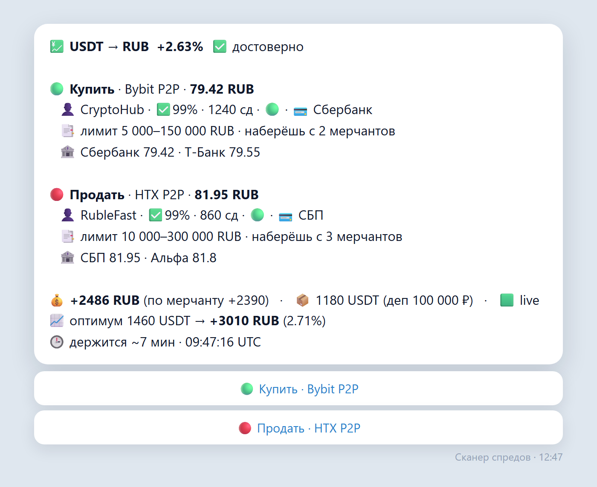
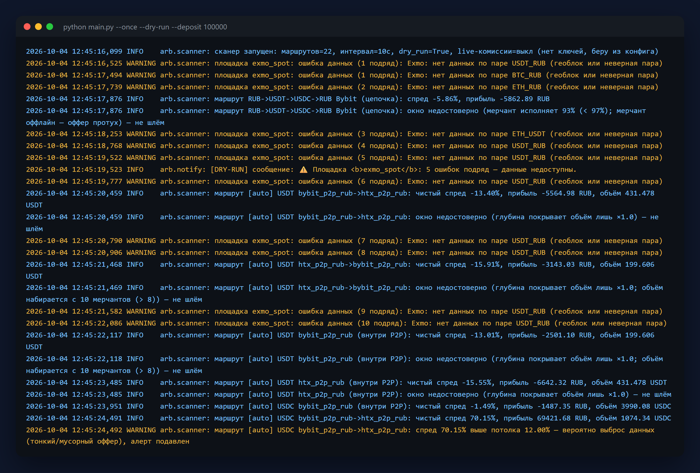
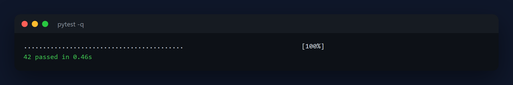

# Сканер арбитражных спредов (read-only)

Асинхронный мониторинг цен на биржах и P2P-витринах. Считает **чистый** спред
(после комиссий, сети, P2P-сбора, платёжки и проскальзывания по глубине стакана)
и шлёт алерт в Telegram, когда окно реально прибыльное.

> ⚠️ **Скрипт только ЧИТАЕТ данные.** Никакого выставления ордеров, торговли,
> выводов или хранения средств. Любые ключи — только read-only.

## Как это выглядит

Алерт приходит в Telegram только когда окно прошло все проверки: чистый спред
после комиссий, глубина стакана под нужный объём, лимиты и надёжность мерчантов.
Кнопки под сообщением открывают нужную площадку в один тап.



Один прогон сканера: площадки опрашиваются параллельно, недостоверные окна
отсеиваются с объяснением причины, недоступные площадки не роняют работу.



Логика расчёта закрыта тестами — спред, комиссии, проскальзывание, ретраи:




## Возможности

- Источники: публичные REST-эндпоинты бирж (спот ордербук) и публичные P2P-витрины.
  Из коробки: `binance_spot`, `okx_spot`, `bybit_spot`, `binance_p2p`, `bybit_p2p`.
  В `config.yaml` сейчас активен только **Bybit** (спот + P2P RUB) — у Binance/OKX
  рублёвый P2P свёрнут; их блоки закомментированы.
- Честный спред: комиссии maker/taker на обе стороны, сетевой сбор за перевод,
  P2P-сбор, издержки платёжного метода, проскальзывание (VWAP по глубине).
- Проверка глубины: если под твой объём не хватает — окно пропускается.
- Типы связок (настраиваются в конфиге): межбиржевой спот, P2P против спота,
  разные способы оплаты внутри одной P2P-площадки.
- Алерт только если ОДНОВРЕМЕННО: чистый спред ≥ порога, прибыль ≥ минимума,
  объёма хватает. Кулдаун + дедуп (SQLite) + анти-фликер (N подтверждений подряд).
- P2P-точность: учёт min/max лимитов объявлений, фильтр ненадёжных мерчантов
  (% исполнения, число сделок, онлайн), проверка что вывод монеты включён.
- Многоногие маршруты-циклы с конвертацией валют (P2P↔спот↔P2P).
- Heartbeat «я жив» и алерт «площадка недоступна» в Telegram. `--test-telegram`.
- Рейт-лимиты по хостам, ретраи с бэкоффом (4xx не ретраятся), таймауты. Ошибки
  логируются, скрипт не падает. Лог пишется в файл (ротация).

## Установка

```bash
pip install -r requirements.txt
cp config.example.yaml config.yaml   # и впиши свои значения
```

Боевой `config.yaml` в репозиторий не попадает (он в `.gitignore`) — в нём
лежат токен бота и настройки площадок. В репозитории только пример.

## Настройка

Всё в `config.yaml`:

1. **Telegram** — `bot_token` (от @BotFather) и `chat_id` (узнать у @userinfobot).
2. **venues** — комиссии каждой площадки (доля: `0.001` = 0.1%). Поставь реальные.
3. **routes** — связки для отслеживания: ноги `buy`/`sell`, размер `size_base`,
   сетевой сбор `network_fee_coin`.
4. **thresholds** — `min_net_spread_pct`, `min_abs_profit`, `cooldown_seconds`.
5. **poll_interval** — интервал опроса.

> Обе ноги маршрута должны быть в **одной валюте котировки** (`quote`).
> Кросс-конвертация (напр. P2P USDT/RUB против спота BTC/USDT) — это многоногий
> маршрут, он намеренно не поддержан и блокируется на старте, чтобы не давать
> ложных сигналов.

## Запуск

```bash
# боевой режим (круглосуточно)
python main.py --config config.yaml

# один прогон без отправки в Telegram (проверка конфига и данных)
python main.py --config config.yaml --once --dry-run --verbose
```

Флаги: `--once` (один цикл), `--dry-run` (не слать в Telegram, только лог),
`--verbose` (DEBUG). Остановка — Ctrl+C.

Чтобы работало круглосуточно — заверни в автозапуск (Планировщик задач Windows /
systemd / Docker) с рестартом при падении.

## Многоногие маршруты (цепочки)

Кроме связки `buy`/`sell` (2 ноги) маршрут можно задать как **цикл из N шагов** с
конвертацией валют — это и есть реальный P2P-арбитраж (купил USDT за RUB → … →
вернулся в RUB). Каждый шаг: `op` (buy/sell), `give` (валюта входа), `get`
(валюта выхода) + параметры площадки. Цепочка обязана начинаться и кончаться в
одной валюте (проверяется при старте). Пример в `config.yaml`.

```yaml
- name: "RUB->USDT->RUB Bybit P2P"
  start_currency: RUB
  start_amount: 100000
  legs:
    - { venue: bybit_p2p_rub, op: buy,  give: RUB,  get: USDT, asset: USDT, fiat: RUB }
    - { venue: bybit_p2p_rub, op: sell, give: USDT, get: RUB,  asset: USDT, fiat: RUB }
```

`transfer_fee_coin` на шаге — сетевой сбор за перевод полученного актива (если
между шагами есть перевод между площадками); с ключами берётся live.

## Надёжность и проверка Telegram

- `confirmations` (в `thresholds`) — окно должно пройти пороги N опросов подряд,
  прежде чем уйдёт алерт (отсекает разовые «дёрги» стакана).
- `heartbeat_seconds` — период сообщения «я жив» (0 = выкл).
- `health_fail_threshold` — после стольких ошибок подряд придёт алерт «площадка
  недоступна»; при восстановлении — «снова отвечает».
- Проверить токен/chat_id, не дожидаясь окна:
  `python main.py --config config.yaml --test-telegram`

## Фильтр P2P-мерчантов

В ноге P2P можно задать: `min_completion` (доля 0..1), `min_orders`,
`online_only: true`. Объявления ненадёжных продавцов отбрасываются ещё до расчёта.

## Точные комиссии через read-only ключи

По умолчанию бот берёт комиссии из `config.yaml` — это приблизительные значения.
Чтобы он считал по **твоим настоящим** и **актуальным** цифрам, дай ему read-only
ключ — бот сам подтянет с биржи:

- твою реальную торговую комиссию maker/taker (с учётом VIP/скидок);
- текущую сетевую комиссию за вывод монеты (она плавает во времени).

### Шаги

1. **Создай read-only ключ** в кабинете биржи. Критично: **только чтение**,
   галки «Spot Trading» и «Withdraw» должны быть **выключены**. Для надёжности
   можно ограничить ключ по IP.
2. **Положи ключ в переменные окружения** (НЕ в файл конфига). PowerShell:
   ```bash
   $env:BINANCE_KEY    = "твой_ключ"
   $env:BINANCE_SECRET = "твой_секрет"
   # OKX дополнительно требует passphrase:
   $env:OKX_KEY = "..."; $env:OKX_SECRET = "..."; $env:OKX_PASSPHRASE = "..."
   ```
3. **Раскомментируй блок `keys`** у нужной площадки в `config.yaml` — там указаны
   только ИМЕНА переменных окружения, не сами ключи.

Что можно вытянуть по биржам: Binance, OKX, Bybit — торговая + сетевая комиссия.
P2P-сбор и **издержку платёжного метода** API не отдаёт — их задаёшь в `fees`
вручную (их знаешь только ты).

В каждом алерте есть строка «Источник комиссий»: 🟩 live / 🟨 частично / 🟧 конфиг —
сразу видно, насколько расчёт точный. Если ключ невалиден или биржа недоступна,
бот молча откатывается на значения из конфига и не падает.

## Как считается спред

Для размера `size_base` по обеим ногам берётся VWAP по уровням стакана/объявлений
(это и есть проскальзывание). Затем:

```
gross  = (avg_sell - avg_buy) * size
costs  = комиссии_бирж + P2P_сбор + платёжка + сетевой_сбор(в котировке)
net    = gross - costs
net %  = net / (avg_buy * size) * 100
```

Алерт уходит только если `net% ≥ порога` И `net ≥ минимума` И глубины хватило.

## Добавить свою площадку

Новый адаптер: класс-наследник `Adapter` в `arb_scanner/adapters/`, реализующий
`fetch_ladder(...) -> Ladder` (только чтение!), и регистрация в
`arb_scanner/adapters/__init__.py`. Дальше — ссылка на него в `venues` конфига.

## Замечания по источникам

- **RUB P2P (проверено живым зондом):** Binance — пусто, OKX — пусто, **Bybit —
  работает** (есть объявления). Поэтому из P2P в рублях активен Bybit (`bybit_p2p`).
- Bybit P2P `side`: `0` = я покупаю базу (ask), `1` = я продаю (bid). `pay_ids`
  фильтрует по способу оплаты (ID из поля `payments` в ответе).
- Соблюдай ToS и рейт-лимиты площадок. `rate_min_interval` в `venues` — на хост.

## Лицензия

MIT — см. [LICENSE](LICENSE).
